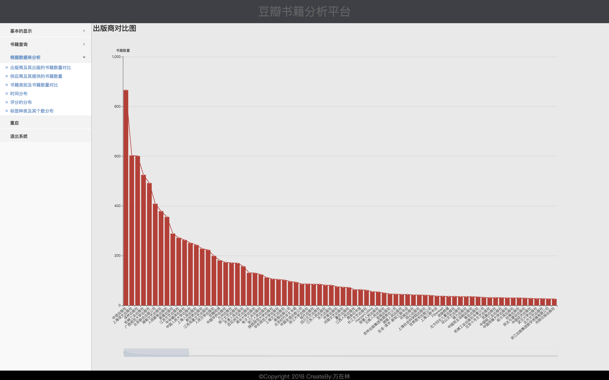
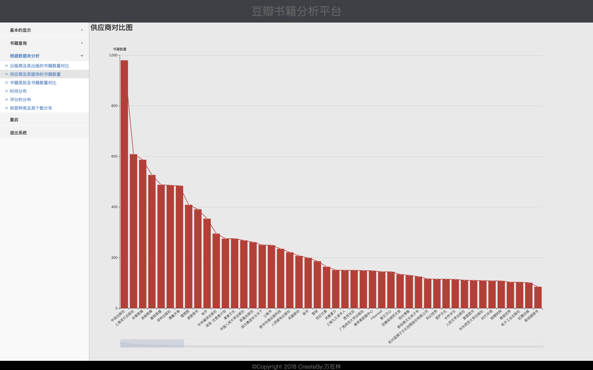
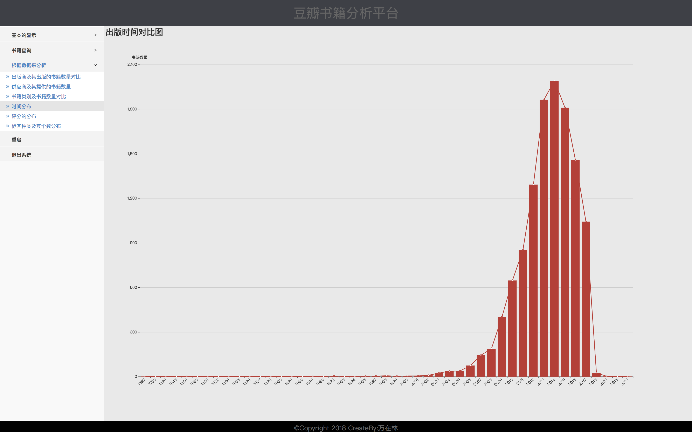
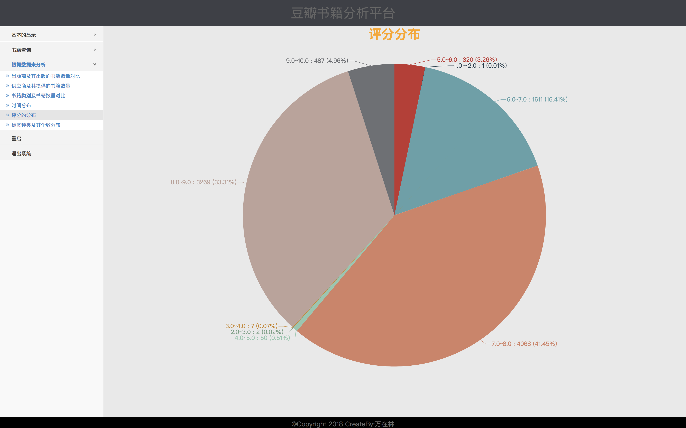
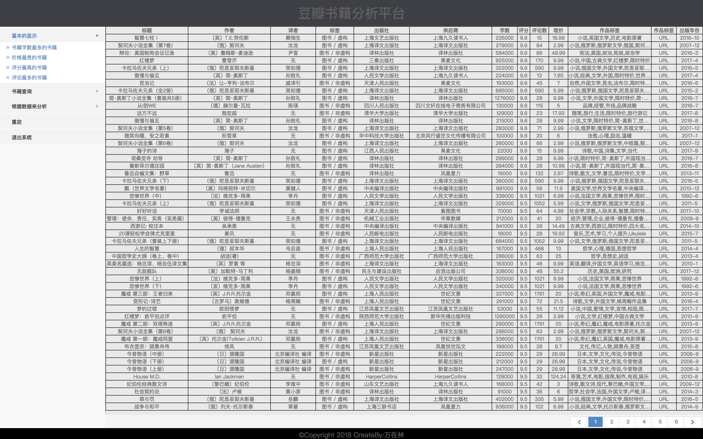
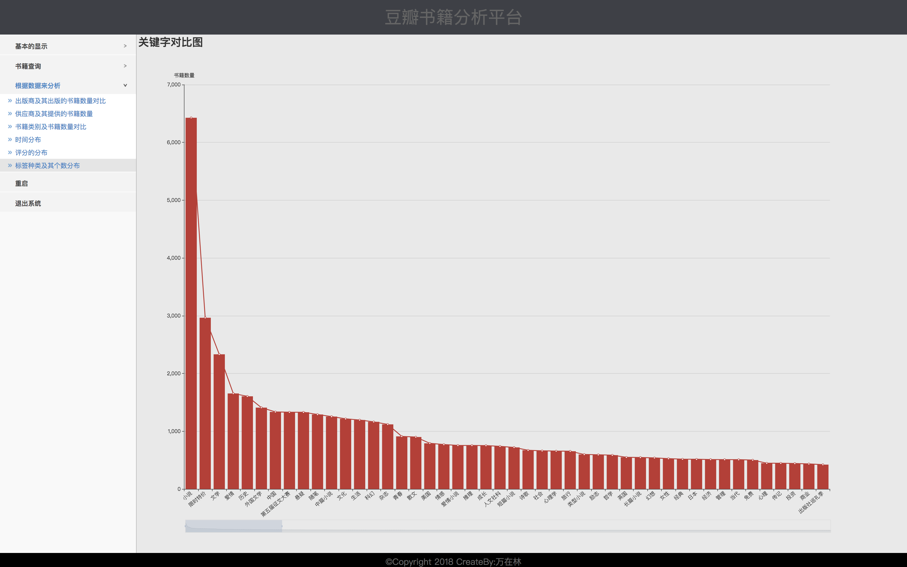
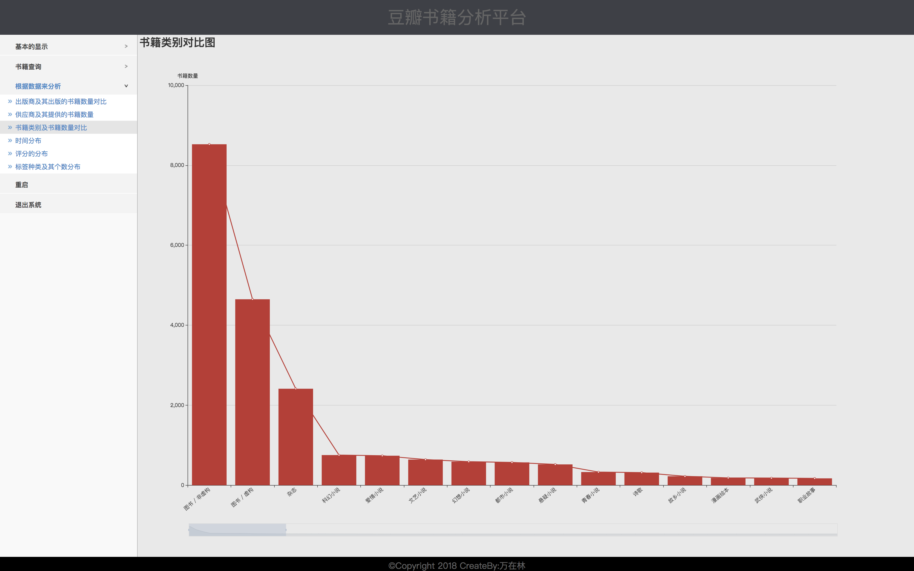

# 豆瓣爬虫

> SSM+WebMagic+ECharts构建

> 项目描述：
   
+ 初衷为了满足自己的好奇心，并完成毕业设计。

>项目模块有：

1. 数据爬取：我利用基于WebMagic来爬取数据，并进行解析，存储利MySQL，利用多线程来分阶段处处理数据解析阶段和数据存储阶段。
2. 后端数据可视化处理：由于数据大量，利用Java8对函数处理的优势，对数据处理。为了提高数据的查询效率，利用MySQL内存表的优势，存储处理后的供显示的数据。
3. 前端可视化显示：利用百度Echarts的柱状图，饼图，折线图来显示。
      
> 涉及技术:

+ Spring+SpringMVC+Mybatis，WebMagic，Echarts，JQuery等技术

**在doc下wiki是开始开发期间写的开发记录**

##  项目截图

